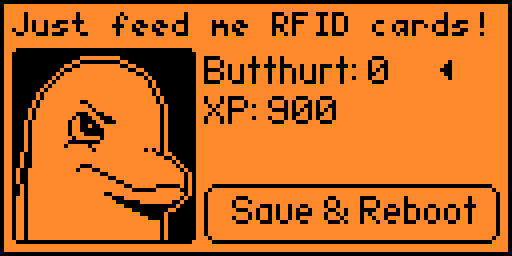

# FlipperAntidepressants
## What you Really Care about↓
**FlipC.org seems to have died, so long and a thanks for all the fish**

ufbt Releases:
* [1.1.2](dist/flipperantidepressant-1.1.2.fap)

## What it is
Updated version of [nymda's](https://github.com/nymda/FlipperAntidepressants) Flipper Zero application that allows changing of the background XP and Butthurt values.  If you don't mess with your flipper he gets angry and acts like he's leaving (much like a 90's tamagotchi).  Its kind of frustrating and in my opinion pointless.

## Why it exists, instead of me using nymda's
nymada wrote the original application, but I wanted to change a few things:

1. "Save & Reboot" didn't seem to work with the original application - this was a bug in the core Flippers implementation.
1. "Butthurt" didn't quite make sense, so I changed that.
1. nymad's humor didn't' match mine, so I gave it lines I thought was funny.
1. Added dolphin_deed & dolphin_state so it would compile with ufbt.
1. Recently updated the application id to conform to new requirements with ufbt/flipc

## Misc
Ported from https://github.com/nymda/FlipperAntidepressants

As of 11/2 there was 339 downloads.  Heckin' cool
